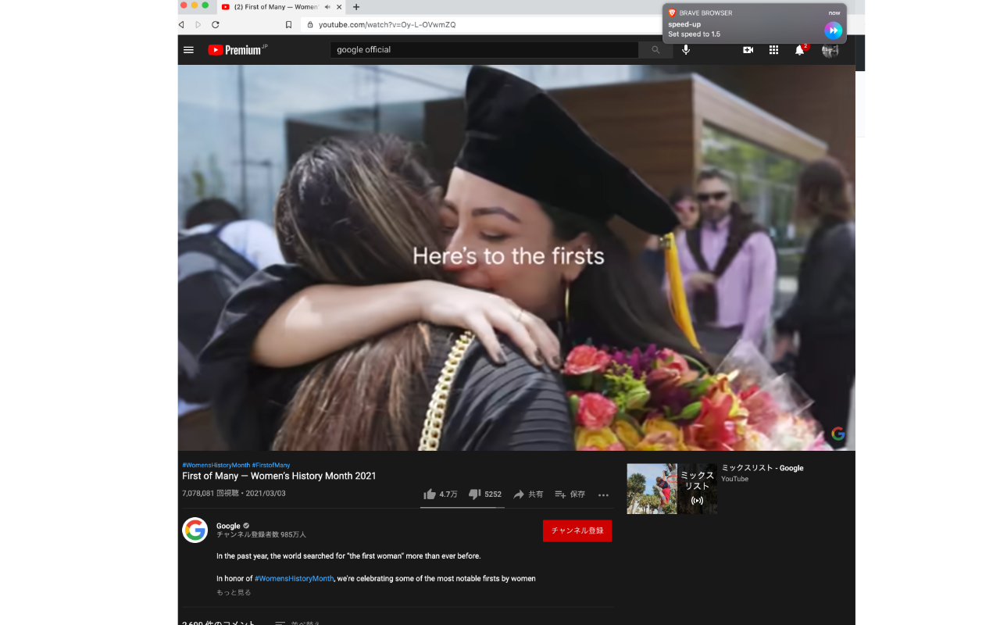

# Video Speed Controller
 </img>

Video Speed Controller is a chrome extension that allows you to control the speed of youtbe video with shortcuts.

- `Ctrl` + `Shift` + `L` :   Speed Up.
- `Ctrl` + `Shift` + `J` :   Speed Down.
- `Ctrl` + `Shift` + `K` :   Speed Neutral.

You can customize the shortcuts at `chrome://extensions/shortcuts`.
